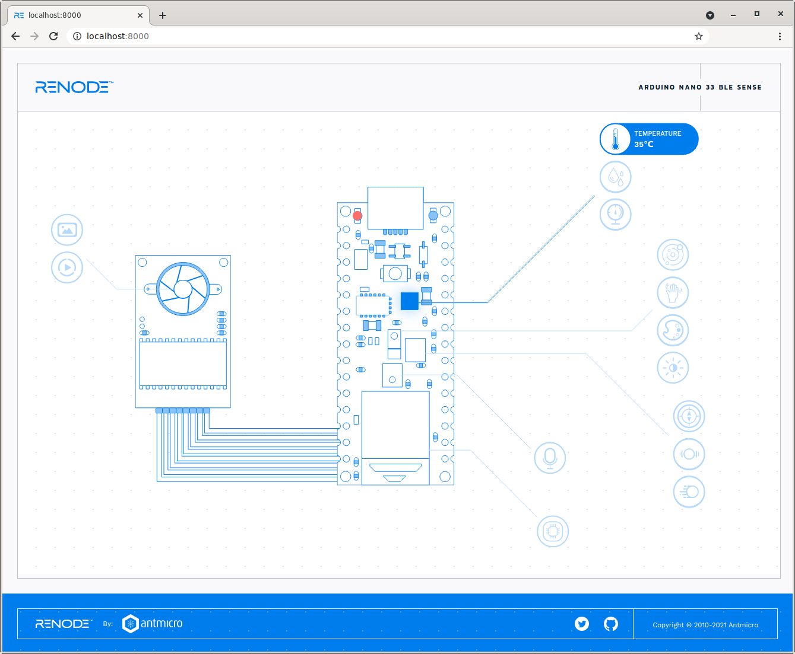

# Renode interactive visualization example

Copyright (c) 2021 [Antmicro](https://www.antmicro.com)

Interactive visualization of an emulated board, to be used with the [Renode Framework](https://www.renode.io).

At the moment the visualisation focuses on Arduino Nano 33 BLE Sense, with Nordic's nRF52840.

This repository is best used with Renode 1.12 or newer.

## Installation

To run this visualisation you need Renode 1.12 installed in the host operating system (see the [documentation](https://docs.renode.io/en/latest/introduction/installing.html) for details).

For Linux, you can use the portable version:
```
wget https://github.com/renode/renode/releases/download/v1.12.0/renode-1.12.0.linux-portable.tar.gz
mkdir renode_portable
tar xf renode-1.12.0.linux-portable.tar.gz -C renode_portable --strip-components=1
export PATH="`pwd`/renode_portable:$PATH"
```

## Usage

To open the interactive visualisation in your browser, run:

```
renode scripts/led.resc
# in Renode:
(machine-0) serveVisualization 8000
```

Then point your browser to [localhost:8000](http://localhost:8000):

```
xdg-open localhost:8000
```

You should be able to see the Arduino Nano wireframe with a blinking LED and some interactive elements.



To run an automatic test with a screen grabber, run

```
cd tests
./test.py
```

See the result in the `*.webm` file.

For additional requirements for running the test script, see [.ci.yml](./.ci.yml) file.

